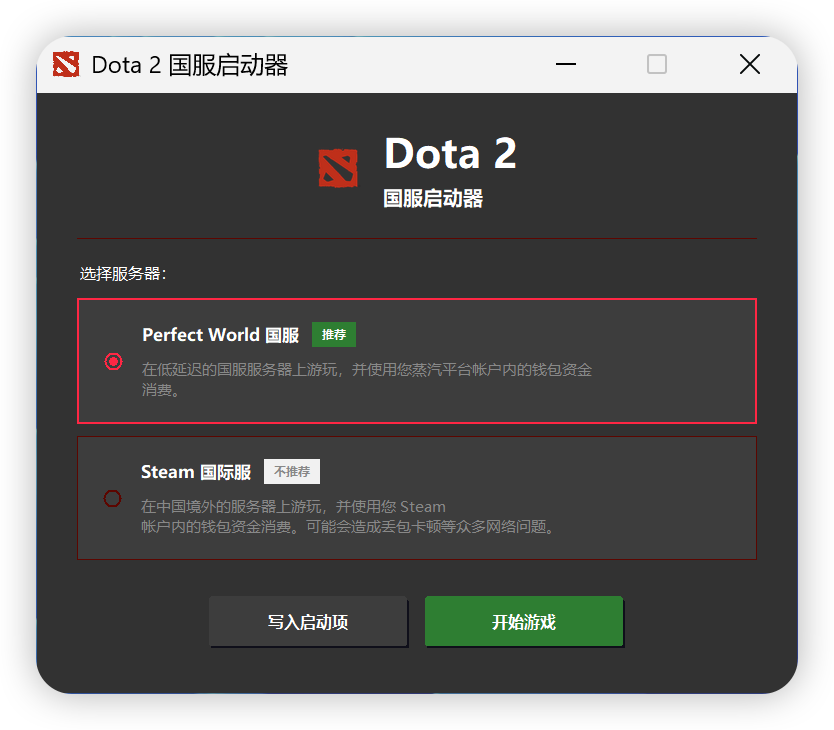

# 🎮 Dota 2 国服启动器

一款简洁优雅的 Dota 2 启动工具，帮助你一键切换国服和国际服。



## ✨ 功能特点

- 🎨 **现代化界面** - 深灰色主题，清晰易读
- 🎯 **服务器切换** - 支持 Perfect World 国服和 Steam 国际服
- ✅ **智能推荐** - 国服显示"推荐"标签，国际服显示"不推荐"提示
- ⚡ **一键配置** - 自动写入启动项，无需手动修改
- 🎮 **快速启动** - 配置完成后可直接启动游戏
- 🔍 **自动检测** - 智能查找 Steam 安装路径
- 💾 **安全可靠** - 自动备份原配置文件

## 📦 下载安装

访问 [Releases](../../releases) 页面下载最新版本 `Dota2Launcher.exe`。

无需安装，双击即可运行。

## 🚀 使用方法

1. **运行程序** - 双击 `Dota2Launcher.exe`
2. **选择服务器**：
   - **Perfect World 国服** ✅ 推荐 - 低延迟国服服务器
   - **Steam 国际服** ⚠️ 不推荐 - 海外服务器，可能有网络问题
3. **点击操作**：
   - **写入启动项** - 仅修改配置，不启动游戏
   - **开始游戏** - 修改配置并自动启动 Dota 2

## 🖥️ 系统要求

- Windows 10/11
- 已安装 Steam 和 Dota 2

## 🛠️ 从源码构建

```bash
# 克隆仓库
git clone <repository-url>
cd -perfectworld

# 安装依赖
pip install pyinstaller Pillow

# 构建可执行文件
pyinstaller --onefile --windowed --name "Dota2Launcher" --icon=icon.ico --add-data "icon.ico;." --add-data "dota2.png;." gui_launcher.py

# 输出位置: dist/Dota2Launcher.exe
```

## 📋 项目结构

```
.
├── gui_launcher.py      # 主程序源码
├── convert_logo.py      # 图标转换工具
├── dota2.png           # 界面 Logo
├── icon.ico            # 应用图标
├── .github/workflows/   # GitHub Actions 配置
└── README.md           # 本文件
```

## ⚠️ 注意事项

- 首次使用会自动检测 Steam 安装路径
- 工具会自动备份原配置到 `.backup.时间戳` 文件
- 国服需要提前绑定完美世界账号
- 建议在关闭 Steam 后切换服务器

## 📄 开源协议

MIT License

---

*本项目与 Valve Corporation 或 Perfect World 无关，仅供学习和便利使用。*
